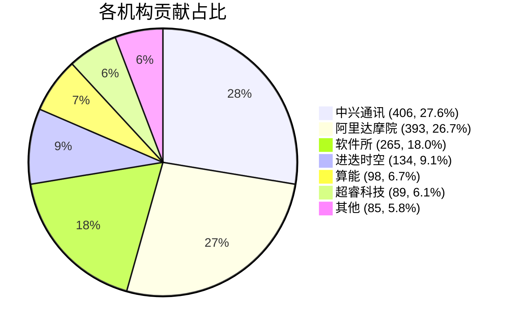

# 📊 内核贡献统计报告

**最后更新时间**: 2026-06-24 11:10:39
**主分支**: `rvck-6.6`
**主分支提交**: ddd010bd
**统计起始点**: `v6.6.141`

---

## 总体统计

| 项目 | 数量 |
|------|------|
| 总提交数 | 1470 |
| 有机构贡献的提交 | 1385 |
| 无机构贡献的提交 | 85 |

### 📌 累计贡献概览

目前 RVCK 基于统计起始点 `v6.6.141`，已累计合入 1470 个补丁（截至 2026-06-24），其中，中兴通讯 406 个提交 (27.6%)，阿里达摩院 393 个提交 (26.7%)，软件所 265 个提交 (18.0%)，进迭时空 134 个提交 (9.1%)，算能 98 个提交 (6.7%)，超睿科技 89 个提交 (6.1%)。

### 📊 代码修改统计

RVCK 累计合入的补丁涉及代码修改：insert 🟢 +1696774 delete 🔴 -67470

## 各机构贡献统计

| 机构 | 提交数 | 占比 | 可视化占比 | 代码修改行数 |
|------|--------|------|------------|--------------|
| [中兴通讯](companies/中兴通讯.md) | 406 | 27.6% | `█████████████░░░░░░░░░░░░░░░░░░░░░░░░░░░░░░░░░░░░░` | +30014/-5291 (35305) |
| [阿里达摩院](companies/阿里达摩院.md) | 393 | 26.7% | `█████████████░░░░░░░░░░░░░░░░░░░░░░░░░░░░░░░░░░░░░` | +68047/-24355 (92402) |
| [软件所](companies/软件所.md) | 265 | 18.0% | `█████████░░░░░░░░░░░░░░░░░░░░░░░░░░░░░░░░░░░░░░░░░` | +1402504/-10445 (1412949) |
| [进迭时空](companies/进迭时空.md) | 134 | 9.1% | `████░░░░░░░░░░░░░░░░░░░░░░░░░░░░░░░░░░░░░░░░░░░░░░` | +44848/-9982 (54830) |
| [算能](companies/算能.md) | 98 | 6.7% | `███░░░░░░░░░░░░░░░░░░░░░░░░░░░░░░░░░░░░░░░░░░░░░░░` | +31569/-1016 (32585) |
| [超睿科技](companies/超睿科技.md) | 89 | 6.1% | `███░░░░░░░░░░░░░░░░░░░░░░░░░░░░░░░░░░░░░░░░░░░░░░░` | +10329/-796 (11125) |

## 📈 可视化图表

## 📋 统计规则说明

### 1. 机构识别规则
- **超睿科技**: @ultrarisc.com
- **进迭时空**: @spacemit.com, @linux.spacemit.com
- **中兴通讯**: @zte.com.cn
- **阿里达摩院**: @linux.alibaba.com
- **算能**: @sophgo.com
- **软件所**: @iscas.ac.cn, @isrc.iscas.ac.cn，特定签名：Weihao Li <ieiao@outlook.com>

### 2. 提交归属规则

贡献统计目前只面向对 RVCK 仓库有贡献的参与机构，因此在对主线补丁反合至 RVCK
等工作中，原补丁作者所属机构暂不计入该统计。

在 RVCK 贡献机构范围中，提交归属统计基于以下规则：

1. **优先原则**: 如果提交的 Author 邮箱属于某机构，则该提交只计入该机构
2. **签名统计**: 如果 Author 不属于任何机构，则统计签名中出现的所有机构
3. **去重规则**: 每个提交对每个机构最多计1次

### 3. 统计范围
- 主分支: `rvck-6.6`
- 起始点: v6.6.141
- 结束点: 统计时的最新提交

---

## 🔧 技术说明

- **统计分支**: `contrib-stats`
- **统计脚本**: [scripts/contrib_stats/](scripts/contrib_stats/)
- **更新方式**: 手动/定时触发，脚本更新时自动触发
- **原始数据**: [data/latest.json](data/latest.json)

---

*最后更新: 2026-06-24 11:10:39*
*生成自主分支提交: ddd010bd*
