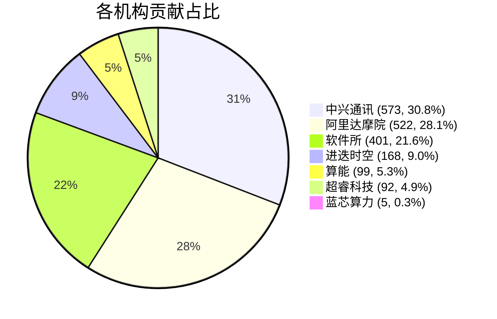

# 📊 内核贡献统计报告

**最后更新时间**: 2026-11-18 16:16:40
**主分支**: `rvck-6.6`
**主分支提交**: 4ac4bd32
**统计起始点**: `v6.6.161`

---

## 总体统计

### 📊 累计代码修改概览

目前 RVCK 基于统计起始点 `v6.6.161`，已累计合入 1798 个补丁，累计合入的补丁涉及代码修改：insert 🟢 +1729800 delete 🔴 -105655 （截至 2026-11-18）。

### 📌 累计贡献概览

目前 RVCK 基于统计起始点 `v6.6.161`，各机构累计有参与贡献工作量为 1860 条记录（截至 2026-11-18），其中，中兴通讯 573 条 (30.8%)，阿里达摩院 522 条 (28.1%)，软件所 401 条 (21.6%)，进迭时空 168 条 (9.0%)，算能 99 条 (5.3%)，超睿科技 92 条 (4.9%)，蓝芯算力 5 条 (0.3%)。

## 各机构参与贡献统计

| 机构 | 贡献数 | 占比 | 可视化占比 | 参与贡献代码修改行数 |
|------|--------|------|------------|----------------------|
| [中兴通讯](companies/中兴通讯.md) | 573 | 30.8% | `███████████████░░░░░░░░░░░░░░░░░░░░░░░░░░░░░░░░░░░` | +37868/-9535 (47403) |
| [阿里达摩院](companies/阿里达摩院.md) | 522 | 28.1% | `██████████████░░░░░░░░░░░░░░░░░░░░░░░░░░░░░░░░░░░░` | +87633/-25360 (112993) |
| [软件所](companies/软件所.md) | 401 | 21.6% | `██████████░░░░░░░░░░░░░░░░░░░░░░░░░░░░░░░░░░░░░░░░` | +1425040/-46517 (1471557) |
| [进迭时空](companies/进迭时空.md) | 168 | 9.0% | `████░░░░░░░░░░░░░░░░░░░░░░░░░░░░░░░░░░░░░░░░░░░░░░` | +47175/-11986 (59161) |
| [算能](companies/算能.md) | 99 | 5.3% | `██░░░░░░░░░░░░░░░░░░░░░░░░░░░░░░░░░░░░░░░░░░░░░░░░` | +31616/-1019 (32635) |
| [超睿科技](companies/超睿科技.md) | 92 | 4.9% | `██░░░░░░░░░░░░░░░░░░░░░░░░░░░░░░░░░░░░░░░░░░░░░░░░` | +10341/-814 (11155) |
| [蓝芯算力](companies/蓝芯算力.md) | 5 | 0.3% | `░░░░░░░░░░░░░░░░░░░░░░░░░░░░░░░░░░░░░░░░░░░░░░░░░░` | +1752/-2 (1754) |

## 📈 可视化图表

```mermaid
pie title 各机构贡献占比
    "中兴通讯 (573, 30.8%)" : 573
    "阿里达摩院 (522, 28.1%)" : 522
    "软件所 (401, 21.6%)" : 401
    "进迭时空 (168, 9.0%)" : 168
    "算能 (99, 5.3%)" : 99
    "超睿科技 (92, 4.9%)" : 92
    "蓝芯算力 (5, 0.3%)" : 5
```

## 📋 统计规则说明

### 1. 机构识别规则
- **超睿科技**: @ultrarisc.com
- **进迭时空**: @spacemit.com, @linux.spacemit.com
- **中兴通讯**: @zte.com.cn
- **阿里达摩院**: @linux.alibaba.com
- **算能**: @sophgo.com
- **软件所**: @iscas.ac.cn, @isrc.iscas.ac.cn，特定签名：Weihao Li <ieiao@outlook.com>
- **蓝芯算力**: @lanxincomputing.com

### 2.贡献归属规则

贡献统计目前只面向对 RVCK 仓库有贡献的参与机构。

在 RVCK 贡献机构范围中，贡献归属统计基于以下规则：

1. 如果提交的 Author 邮箱属于某机构，则该机构的贡献数量增加 1
2. 如果提交的签名列表中出现的签名邮箱属于某机构，则该机构的贡献数量增加 1
3. 针对每个提交，同一个机构的贡献如果出现多次则最多计 1 次

### 3. 统计范围
- 主分支: `rvck-6.6`
- 起始点: v6.6.161
- 结束点: 统计时的最新提交

---

## 🔧 技术说明

- **统计分支**: `contrib-stats`
- **统计脚本**: [scripts/contrib_stats/](scripts/contrib_stats/)
- **更新方式**: 手动/定时触发，脚本更新时自动触发
- **原始数据**: [data/latest.json](data/latest.json)

---

*最后更新: 2026-11-18 16:16:40*
*生成自主分支提交: 4ac4bd32*
